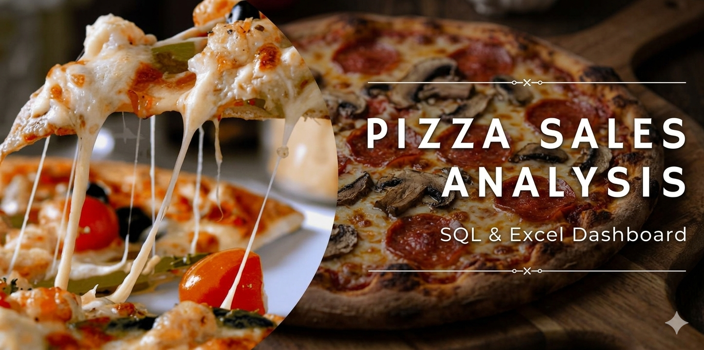
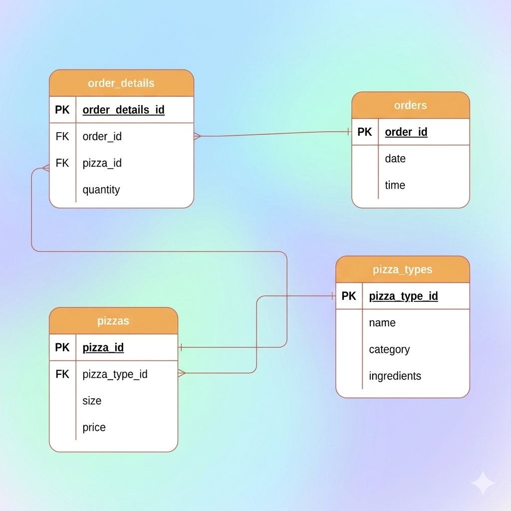
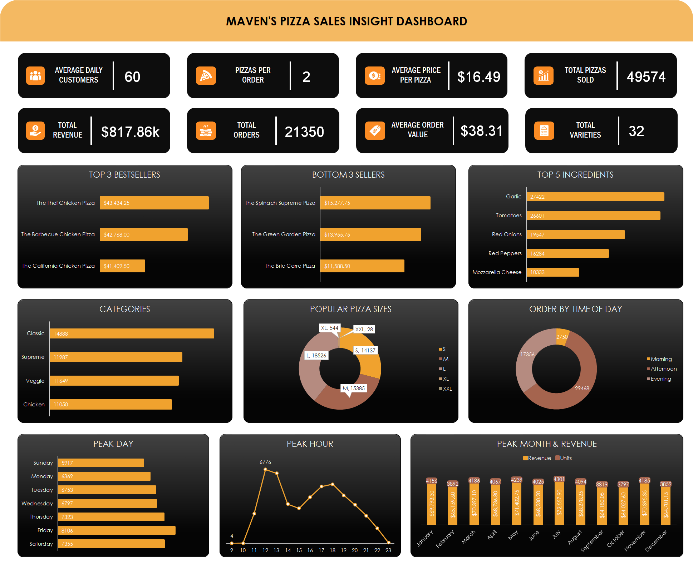

# Maven's Pizza Sales Insights

## Table of Contents

- [Project Background](#project-background)
- [Project Objective](#project-objective)
- [Tools Used](#tools-used)
- [Data Structure](#data-structure)
- [Analysis Workflow](#analysis-workflow)
- [Key Findings](#key-findings)
- [Dashboard](#dashboard)
- [Recommendations](#recommendations)
- [Repository Structure](#repository-structure)
- [Project Resources](#project-resources)

## Project Background

This project analyses a full year of sales data from a fictional pizza restaurant. The purpose of the analysis is to transform raw transaction data into meaningful business insights that can support menu strategy, staffing, inventory planning, and promotional decisions.

The analysis examines product performance, customer ordering patterns, pizza-size and category preferences, popular ingredients, peak business periods, and monthly sales trends. SQL was used to query and analyse the data, while Microsoft Excel was used to build an interactive dashboard that communicates the findings clearly.

The dataset contains 48,620 order-detail records and represents 21,350 customer orders. Across the year, the restaurant sold 49,574 pizzas and generated approximately $817.86K in revenue.

## Project Objective

The project answers the following business questions:

- Which pizzas generate the highest and lowest revenue?
- Which pizza categories and sizes are most popular?
- Which ingredients appear most frequently in customer orders?
- What are the busiest hours and days of the week?
- Which month generates the highest revenue and sales volume?
- How can the restaurant use these insights to improve sales and operations?

## Tools Used

- **SQL Server** — storing and querying pizza sales data.
- **SQL** — joining tables, calculating KPIs, and answering business questions.
- **Microsoft Excel** — creating KPI cards, charts, pivot tables, and the interactive sales dashboard.

## Data Structure

The dataset is made up of four connected tables. The `order_details` table links customer orders to individual pizza items, while the `pizzas` and `pizza_types` tables provide details about each pizza’s size, price, category, and ingredients.

| Table | Description |
|---|---|
| `order_details` | Line item details for every order, including `order_details_id`, `order_id`, `pizza_id`, and quantity. |
| `orders` | Order level information, including `order_id`, order date, and order time. |
| `pizzas` | Pizza variants, including `pizza_id`, `pizza_type_id`, size, and price. |
| `pizza_types` | Pizza names, categories, and ingredient lists. |

### Table Relationships

- One order can contain multiple order-detail records.
- Each order-detail record refers to one pizza variant.
- Each pizza variant belongs to one pizza type.
- Pizza types contain the product name, category, and ingredients used in the pizza.

## Analysis Workflow

1. Reviewed the data dictionary and explored the four source tables.
2. Joined orders, order details, pizzas, and pizza types through SQL.
3. Calculated core business KPIs such as revenue, total orders, total pizzas sold, average order value, and average pizza price.
4. Analysed bestsellers, low-performing pizzas, category demand, pizza sizes, ingredient popularity, peak hours, peak days, and monthly performance.
5. Built an Excel dashboard to present the results in a clear and interactive format.

## Key Findings

### Overall Business Performance

| Metric | Result |
|---|---:|
| Total revenue | $817.86K |
| Total orders | 21,350 |
| Total pizzas sold | 49,574 |
| Average daily customers | 60 |
| Average pizzas per order | 2.32 |
| Average order value | $38.31 |
| Average pizza price | $16.49 |
| Pizza varieties | 32 |

### Pizza Performance

The Thai Chicken Pizza is the strongest revenue-generating product, contributing approximately **$43.4K** in sales. The Barbecue Chicken Pizza follows closely with around **$42.8K**, while the California Chicken Pizza completes the top three.

The Brie Carre Pizza is the lowest-performing pizza, generating approximately **$11.6K** in revenue. The Thai Chicken Pizza therefore produces around **274% more revenue** than the Brie Carre Pizza.

This pattern shows that chicken-based pizzas are strong revenue drivers and should receive continued attention in promotions, menu placement, and inventory planning.

### Category and Size Preferences

The **Classic** category is the most popular category, with **14,888 pizzas sold**. It is followed by Supreme, Veggie, and Chicken categories.

Large pizzas are the most popular size, with **18,526 units sold**. Small and medium pizzas also perform well, while XL and XXL pizzas have very low demand. This indicates that customers typically prefer standard-sized pizzas over extra-large options.

### Ingredient Popularity

Garlic is the most popular ingredient, contributing to approximately **$27.4K** in sales. Tomatoes and red onions follow, generating around **$26.6K** and **$19.5K** respectively.

The five most popular ingredients are:

1. Garlic  
2. Tomatoes  
3. Red Onions  
4. Red Peppers  
5. Mozzarella Cheese  

These ingredients can guide menu development, stock planning, and promotional bundles.

### Peak Hours and Days

The afternoon is the busiest period, with **29,468 pizzas sold**, followed by the evening with **17,356 pizzas sold**. Morning demand is considerably lower.

The busiest hour is **12 PM**, when the restaurant sells **6,776 pizzas**. This indicates a strong lunch-time demand pattern.

Friday is the strongest sales day, with **8,106 pizzas sold**. Thursday and Saturday are also high-demand days. The restaurant should prepare additional staff and inventory for these periods to maintain service speed and product availability.

### Monthly Performance

July is the highest-performing month, generating approximately **$72.6K** in revenue and selling **4,301 pizzas**.

October is the weakest month by revenue, which may reflect seasonal shifts in customer demand. This period represents an opportunity for targeted promotions, limited-time menu items, or themed campaigns.

## Dashboard

The Excel dashboard summarises the project’s key metrics and findings in one place. It includes KPI cards, bestseller and low-seller comparisons, category and size preferences, ingredient demand, order distribution by time of day, peak-day performance, peak-hour performance, and monthly revenue trends.

The completed interactive Excel dashboard is available in:

[`Maven Pizza Sales Insight Dashboard.xlsx`](Maven%20Pizza%20Sales%20Insight%20Dashboard.xlsx)

A summary presentation of the project findings is available in:

`Maven_s_Pizza_Sales_Insight.pptx`

## Project status

- [x] Project setup
- [x] Dataset documentation
- [x] SQL analysis
- [x] Excel dashboard metrics
- [x] Interactive dashboard
- [x] Presentation
